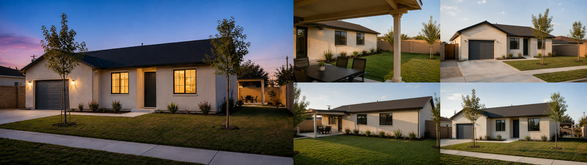
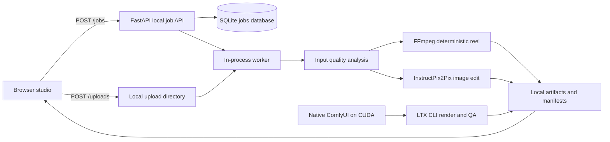

<p align="center">
  
</p>

<h1 align="center">ReelMeListing</h1>

<p align="center">A local studio and auditable media pipeline for turning property photos into reviewed listing reels.</p>

<p align="center">
  <a href="#run-the-local-studio">Run locally</a> ·
  <a href="#how-the-pipeline-works">Pipeline</a> ·
  <a href="#local-api">API</a> ·
  <a href="#testing-and-builds">Tests</a>
</p>

ReelMeListing helps developers and visual-media teams assemble short vertical property reels from real source photos. It records source hashes, configuration, quality reports, and output artifacts. It also supports local image-edit candidates and an optional ComfyUI/LTX video workflow on CUDA hardware.

The project does not certify that generated media is truthful. A human must review every delivery candidate. LTX bridges are synthetic architectural visualizations, not verified walkthroughs.

## Synthetic property demo

<p align="center">
  
</p>

<p align="center"><sub>Tracked synthetic source set used to exercise the multi-view workflow.</sub></p>

<p align="center">
  <a href="artifacts/ltx-timed-reels/no-zoom-2026-08-16/reels/15s/reel.mp4">
    
  </a>
</p>

<p align="center"><sub>Animated preview of the tracked 15-second reel. Select it to open the MP4.</sub></p>

## What the project does

The normal browser workflow is:

1. Upload two to twelve photos of one property
2. Label each photo by visible area and viewpoint
3. Select only compatible photo pairs for an optional LTX bridge
4. Assemble a deterministic 9:16 reel and inspect per-image input quality results
5. Optionally create image-edit candidates, then review them before video generation

The browser runs against a localhost-only FastAPI service. It stores uploaded files, job records, reports, and generated artifacts under `runs/service/`.

| Capability | Status | What it does |
|---|---|---|
| Deterministic reel | Available in browser and CLI | Creates a 1080×1920 H.264 reel from ordered photos with fixed crops, zoom, and cross-dissolves |
| Input quality gate | Available in browser and CLI | Measures blur, clipping, color cast, and vertical-line quality before model work |
| Day-to-dusk image edit | Available locally | Runs pretrained InstructPix2Pix after an accepted input-quality report |
| Candidate evaluation | Available in CLI | Measures structural and image-quality signals, then exports a human-review worksheet |
| LTX source clips and bridges | Available in CLI with native ComfyUI | Renders LTX candidates, runs temporal screening, and exports a review worksheet |
| LoRA readiness | Available in browser and CLI | Checks whether a licensed, property-separated paired dataset is ready for a reviewed pilot |

## Run the local studio

The React application is bundled and served by the FastAPI process. You do not need Docker for the normal workflow.

### Prerequisites

- Python 3.12 or 3.13
- [uv](https://docs.astral.sh/uv/)
- Node.js and npm
- FFmpeg on your `PATH`

Install the base and development dependencies, then install the web dependencies:

```sh
uv sync --extra dev --python 3.12
npm --prefix webapp ci
```

Start the studio and open [http://127.0.0.1:8000](http://127.0.0.1:8000):

```sh
make run
```

On Apple Silicon, install the MPS image-editing extras and start the MPS profile:

```sh
uv sync --extra mps --python 3.12
make run-mps
```

The MPS profile supports preview-only image editing. It does not enable video generation or authoritative benchmarks.

### Use CUDA for evaluation and LTX rendering

The `remote_cuda` profile enables evaluation-mode image editing, video generation, and benchmark recording. Install the GPU extras on the CUDA workstation and confirm that its PyTorch build detects the GPU before running model work:

```sh
uv sync --extra gpu --python 3.12
uv run python -c "import torch; print(torch.cuda.is_available())"
```

LTX rendering also requires a native ComfyUI checkout. Point `configs/ltx_comfyui.yaml` at that checkout, install the configured LTX checkpoint, text encoder, and VAE, then start ComfyUI on `127.0.0.1:8188` before using the LTX CLI commands.

## Use the browser studio

The browser exposes four tabs:

| Tab | Use it for | Important behavior |
|---|---|---|
| **Reel studio** | Upload, label, order, and assemble photos | Sends 2–12 images to the local API and creates the deterministic reel |
| **Image edit** | Create InstructPix2Pix candidates | Requires one uploaded photo and an input-quality acceptance result |
| **Quality** | Inspect input QA and save a generated MP4 | QA informs review; it does not prove property truthfulness |
| **Improve a treatment** | Check LoRA pilot readiness | Reads local JSON manifests in the browser and does not start training |

### Choose a bridge or a cut

Only select a bridge for views of the same property with plausible visual overlap. The browser stores that selection in job lineage. The current browser reel remains deterministic and joins all shots with cross-dissolves; it does not invoke ComfyUI or render LTX bridges.

Use the CLI LTX workflow to render a selected bridge and assemble it into a final reel. Use a deliberate cut for unrelated areas, uncertain geometry, or an LTX candidate that fails review.

| Control | Allowed values | Default | Effect |
|---|---:|---:|---|
| Photo count | 2–12 | None | Ordered source set for one property |
| Visible area | `front`, `backyard`, `patio`, `pool`, `detail`, `unclassified` | `unclassified` | Stored with each upload in job lineage |
| Viewpoint | `left angle`, `wide view`, `right angle`, `close detail`, `unclassified` | `unclassified` | Helps identify compatible bridge pairs |
| Bridge intent | `Camera move` or `Lighting only` | Camera move | Stored for a later LTX render; lighting-only also requires same-composition confirmation |
| Bridge length | 0.75–5s | 3s | Stored in job lineage; LTX CLI accepts 2–6s bridge durations |
| Final length | 8–20s | 12s | Sets deterministic reel target duration |
| Scene dissolve | 0.2–5s | 0.5s | Sets the cross-dissolve duration between deterministic reel shots |
| Render profile | `local_mps`, `remote_cuda` | `local_mps` | Selects the runtime profile for image-edit jobs |

> [!NOTE]
> A lighting-only bridge fits two images with essentially the same camera position and framing, such as a daytime and twilight pair. It may change light and sky, but not visible property features.

## How the pipeline works

The deterministic reel and local job API run without a queue service. FastAPI schedules one in-process background task per submitted job. SQLite records state transitions and artifact metadata.



Every processing path writes run-specific JSON manifests. Those records include source paths and hashes; model paths also record runtime, configuration, and output provenance.

### Quality and review gates

Input QA checks blur, highlight and shadow clipping, color cast, and vertical-line error. Vertical-line rejection is disabled in the default configuration because it is a perspective proxy.

Image candidate evaluation measures edge preservation, blur ratio, luminance change, black pixels, and vertical-line drift. Video QA measures frame differences, edge preservation against the hero image, and black-frame fraction. These checks may reject an artifact or queue it for human review; they do not approve a property claim.

### Image editing

`configs/image_editing.yaml` selects the Diffusers InstructPix2Pix adapter (`timbrooks/instruct-pix2pix`) and produces two candidates at 512 px by default. The MPS-specific configurations retain float32 decoding and can raise the working dimension to 768 px for preview experiments.

Use an accepted input-quality report when running the CLI directly:

```sh
uv run python -m listing_to_reel edit image \
  --image data/source/synthetic_simple_suburban_home/03-front-day-left.png \
  --input-quality-report runs/input-quality/your_report_id/report.json \
  --instruction "Convert this daylight exterior to a natural warm dusk scene; preserve visible geometry." \
  --seed 42
```

Run `analyze input` first to create `your_report_id`:

```sh
uv run python -m listing_to_reel analyze input \
  --image data/source/synthetic_simple_suburban_home/03-front-day-left.png
```

### LTX clips, bridges, and final reels

The LTX CLI uses ComfyUI and the settings in `configs/ltx_comfyui.yaml`. It renders native 16:9 source clips at 1024×576, 89 frames, and 30 fps. Final LTX delivery reels use a portrait treatment that retains the landscape foreground and fills the remaining space with a blurred background.

Render only explicitly named source views and compatible bridge pairs:

```sh
uv run python -m listing_to_reel video render-ltx \
  --property-id synthetic-simple-suburban-home \
  --source front_left=data/source/synthetic_simple_suburban_home/03-front-day-left.png,slow_lateral_gimbal_glide \
  --source front_wide=data/source/synthetic_simple_suburban_home/05-front-day-wide.png,gentle_dolly_in \
  --bridge-pair front_left_to_wide=front_left,front_wide,spatial_overlap \
  --bridge-candidate front_left_to_wide=3 \
  --config configs/ltx_comfyui.yaml
```

Screen the rendered candidates before assembly:

```sh
uv run python -m listing_to_reel video qa-ltx \
  --render-manifest runs/ltx-videos/your_run_id/manifest.json
```

The QA command exports a review worksheet. Assemble only clips and bridges that a reviewer approves. A reel containing an invented bridge must be described as a **synthetic architectural visualization**.

### LoRA readiness, not automatic training

The project does not train a model by default. It can assess whether a narrow InstructPix2Pix LoRA pilot has the required rights, matched daylight-to-dusk pairs, property-separated train/validation/test splits, and prerequisite evaluation evidence.

```sh
uv run python -m listing_to_reel lora assess \
  --dataset-manifest path/to/dataset_manifest.json \
  --evidence path/to/evidence.json
```

The pilot configuration lives in `configs/lora_pilot.yaml`. It freezes the base model and targets the image-editing adapter only.

## Local API

The API binds to `127.0.0.1` in the documented commands. It has no authentication and no multi-tenant isolation, so do not expose it beyond the local machine.

| Method | Route | Purpose |
|---|---|---|
| `GET` | `/` | Serves the bundled React studio |
| `GET` | `/runtime` | Reports environment capabilities and configured MPS/CUDA profiles |
| `POST` | `/uploads` | Stores 1–12 JPEG, PNG, or WebP files, each up to 20 MB |
| `POST` | `/jobs` | Submits a `fixture_reel` or `image_edit` job and returns `202 Accepted` |
| `GET` | `/jobs` | Lists local jobs |
| `GET` | `/jobs/{job_id}` | Fetches one job and its status |
| `POST` | `/jobs/{job_id}/retry` | Requeues a failed job; returns `409` for other states |
| `GET` | `/jobs/{job_id}/artifacts` | Lists stored artifacts with SHA-256 and size |
| `GET` | `/jobs/{job_id}/artifacts/{name}` | Downloads one artifact |
| `POST` | `/lora/readiness` | Evaluates a LoRA dataset and evidence manifest without training |

This request uses two tracked synthetic sample views and creates a 12-second deterministic reel with a 0.5-second dissolve. If you upload files first, replace these paths with the `source_paths` returned by `POST /uploads`:

```sh
curl --request POST http://127.0.0.1:8000/jobs \
  --header "Content-Type: application/json" \
  --data '{
    "kind": "fixture_reel",
    "source_paths": [
      "data/source/synthetic_simple_suburban_home/03-front-day-left.png",
      "data/source/synthetic_simple_suburban_home/05-front-day-wide.png"
    ],
    "settings": {
      "target_duration_seconds": 12,
      "transition_seconds": 0.5
    },
    "image_annotations": [
      {"index": 0, "area": "front", "viewpoint": "wide view"},
      {"index": 1, "area": "backyard", "viewpoint": "wide view"}
    ]
  }'
```

`POST /jobs` rejects invalid image counts, missing image-edit instructions, annotations outside the submitted photo list, and bridges that reuse the same source index. It also returns the job in `queued`, `running`, `succeeded`, or `failed` state.

## Configure runtimes and models

Configuration is file-based. There is no required `.env` file and the repository defines no cloud API key.

| File | Controls |
|---|---|
| `configs/local_mps.yaml` | Apple Silicon preview profile: MPS, 512 px image editing, attention slicing, no video or benchmark authority |
| `configs/remote_cuda.yaml` | CUDA evaluation profile: 1024 px image editing, video enabled, benchmark authority |
| `configs/image_editing.yaml` | InstructPix2Pix model, scheduler, steps, guidance, candidates, and output size |
| `configs/input_quality.yaml` | Input-quality thresholds and vertical-line policy |
| `configs/evaluation.yaml` | Candidate-evaluation thresholds |
| `configs/ltx_comfyui.yaml` | Native ComfyUI endpoint, model paths, resolution, frame count, FPS, steps, and seed |
| `configs/lora_pilot.yaml` | Frozen-base LoRA pilot settings |

`compose.yaml` and the two Dockerfiles are validation profiles, not the normal studio deployment path. They run environment or runtime-configuration commands. The API Docker image does not launch Uvicorn or build the frontend.

## Testing and builds

Use the repository Makefile for the standard checks:

```sh
make lint
make test
make web-build
```

The checks map to these commands:

- `uv run --extra dev ruff check .`
- `uv run --extra dev pytest`
- `npm --prefix webapp run build`

For frontend hot reload, start Vite separately after installing web dependencies:

```sh
npm --prefix webapp run dev
```

Vite proxies browser API requests to the local FastAPI service during development. Run the API in another terminal with `make run` or `make run-mps`.

## Repository map

```text
listing_to_reel/
  analysis/       input-quality analysis
  api/            localhost FastAPI service and SQLite job repository
  editing/        InstructPix2Pix request, generation, and provenance
  evaluation/     candidate metrics and human-review import
  finetuning/     LoRA readiness contracts and checks
  media/          image normalization, FFmpeg, and deterministic reel assembly
  video/          Stable Video Diffusion and ComfyUI/LTX workflows
configs/          runtime, quality, model, LTX, and LoRA settings
webapp/           React + TypeScript browser studio and production bundle
tests/            pytest coverage for the pipeline and API
data/manifests/   source and rights metadata for the sample image set
artifacts/        tracked example LTX inputs and rendered outputs
```

## Sample assets

The repository contains two distinct sample sets:

- `data/source/synthetic_simple_suburban_home/`: five related views of a synthetic property for multi-view workflow testing
- `data/source/unsplash_exteriors/`: 27 individual Unsplash exterior photos with provenance in `data/manifests/unsplash_exterior_mvp.json`

The Unsplash images are not a single listing. Their manifest marks `listing_group_id` as `null`, so do not use them as a multi-view property set. Review each source's rights, depicted-property considerations, and public-use suitability before reuse.

Tracked LTX renders live under `artifacts/ltx-timed-reels/`. They are reference outputs, not a claim that every generated frame is property-accurate. The repository has a brand logo but no maintained browser screenshot or GIF for the README.

## Security, privacy, and limits

- **Local only**: Bind the service to `127.0.0.1`; it has no authentication or tenant boundaries
- **Uploads**: The API accepts only JPEG, PNG, and WebP uploads, with 1–12 files and a 20 MB maximum per file
- **Persistence**: Jobs and artifacts remain in `runs/service/`; source files, manifests, and outputs contain local paths and hashes
- **Human review**: Input QA and candidate metrics are screening tools, not proof of factual property representation
- **Synthetic transitions**: Do not present LTX bridges as a verified physical camera path between photographs

## Current constraints

- The browser can plan bridges but does not yet render LTX clips or bridges itself
- ComfyUI/LTX setup is manual and CUDA-specific
- Stable Video Diffusion is a separate, CUDA-only four-second hero-clip path; the browser does not submit it
- The LoRA feature checks readiness only; it does not start or manage training
- No deployment configuration, CI workflow, remote storage, cloud inference provider, analytics, or user authentication is included

## License

ReelMeListing is available under the [MIT License](LICENSE).
